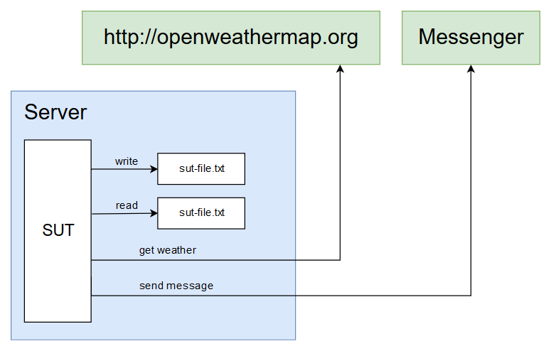
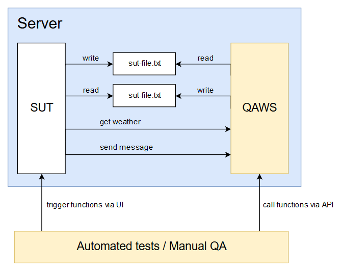

# QAWS example
Example of using QA Web Services.  
  
In this repo you may find:  
- `sut` - System Under Test  
- `messenger` - simple web app that can only receive messages and display them on UI  
- `qaws` - QA Web Services that helps to test SUT features  
- `automated-tests` - automated tests that Test Automation team could write.
Sorry, you won't find any TAF layers, just simple straightforward tests.
The purpose of these examples is just to show how to work with QAWS.

### Before trying it out
- Make sure you have Java 8 (JDK) installed and `JAVA_HOME` variable is pointed at you JDK directory;
- Make sure you have downloaded and unzipped [Tomcat](https://tomcat.apache.org/download-80.cgi)
somewhere on your machine and set `CATALINA_HOME` environment variable to that directory.  

### Running SUT
Here is what SUT functions look like on the diagram:  
   

To run the SUT application build it with Gradle wrapper like this:
```
cd sut
gradlew build
```
Do the same thing with `messenger`.
Then copy war files from `sut/build/libs/sut.war` and `messenger/build/libs/messenger.war` to `<tomcat_dir>/webapps` directory.
Then start Tomcat by executing the file `<tomcat_dir>/bin/startup.bat`.
You can explore the application at [http://localhost:8080/sut](http://localhost:8080/sut/).  

### Deploying QAWS and running tests
Here is how QAWS is integrated into the infrastructure with the SUT and automated tests:  
   

Start from building QAWS with Gradle wrapper:
```
cd qaws
gradlew build
```
Then copy war file from `qaws/build/libs/qaws.war` to `<tomcat_dir>/webapps` directory.  
Check that QAWS are there at [http://localhost:8080/qaws](http://localhost:8080/qaws/).  
Update the SUT properties file
[sut/src/main/resources/application.properties](https://github.com/barik87/qaws-example/blob/master/sut/src/main/resources/application.properties)
according to the comments there, so that SUT would be pointed at QAWS endpoints instead of the real world.  
  
Now you can run automated tests:
```
cd automated-tests
gradlew test
```

### Swagger UI for QAWS
Swagger UI makes your API visible and pretty.
This is what was done to use Swagger UI in QAWS:
- added couple dependencies to the `build.gradle` file:
```
ext {
    swaggerVersion = '2.7.0'
}

dependencies {
    ...
    compile("io.springfox:springfox-swagger2:${swaggerVersion}")
    compile("io.springfox:springfox-swagger-ui:${swaggerVersion}")
    ...
```
- added [SwaggerConfig](https://github.com/barik87/qaws-example/blob/master/qaws/src/main/java/com/example/qaws/swagger/SwaggerConfig.java) class with its content
Check out available QAWS API at: [http://localhost:8080/qaws/swagger-ui.html](http://localhost:8080/qaws/swagger-ui.html)
